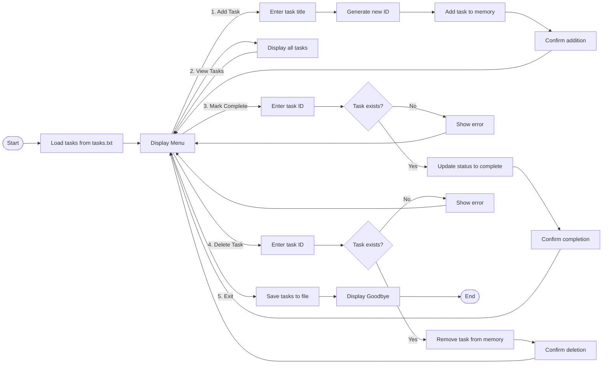

# CheckMate

CheckMate is a lightweight command-line task manager that helps you organize your daily tasks with persistent storage. It provides essential task management features without unnecessary complexity.

## Features

- **Persistent Storage**: Tasks saved to `tasks.txt` file
- **Add New Tasks**: Create tasks with unique IDs
- **View All Tasks**: See your complete task list
- **Mark as Complete**: Track task progress
- **Delete Tasks**: Remove completed or unnecessary items
- **Auto ID Management**: Sequential task numbering
- **File-Based Storage**: No database required

## How It Works

CheckMate follows a simple workflow:
1. Loads existing tasks from `tasks.txt` on startup
2. Provides an interactive menu for task management
3. Maintains tasks in memory during operation
4. Saves all changes to file when exiting

## Demonstration

*(TBA)*

## Usage

1. Run the script:
```bash
python main.py
```

2. Use the interactive menu:
```
-----CHECKMATE-----
Task Manager Menu:
1. Add Task
2. View Tasks
3. Mark Task as Complete
4. Delete Task
5. Exit
```

3. Follow the on-screen prompts for each operation

## Program Flow Diagram



## File Structure

- `tasks.txt`: Plain text storage file with format  
  `[ID] | [Title] | [Status]`  
  Example: `1 | TASK X | COMPLETE`

## Requirements

- Python 3.6+
- No external dependencies

## Installation

1. Clone this repository:
```bash
git clone https://github.com/BLShaw/checkmate.git
```

2. Navigate to project directory:
```bash
cd checkmate
```

3. Run the script:
```bash
python main.py
```

## Why Use CheckMate?

- **Simplicity**: No complex setup or learning curve
- **Portability**: Works on any system with Python
- **Lightweight**: Minimal resource usage
- **Transparency**: Human-readable storage format
- **Reliability**: Automatic data persistence

## Contributing

Contributions are welcome! Please follow these steps:
1. Fork the repository
2. Create your feature branch (`git checkout -b feature/NewFeature`)
3. Commit your changes (`git commit -m 'Add a new feature'`)
4. Push to the branch (`git push origin feature/AddFeature`)
5. Open a Pull Request


